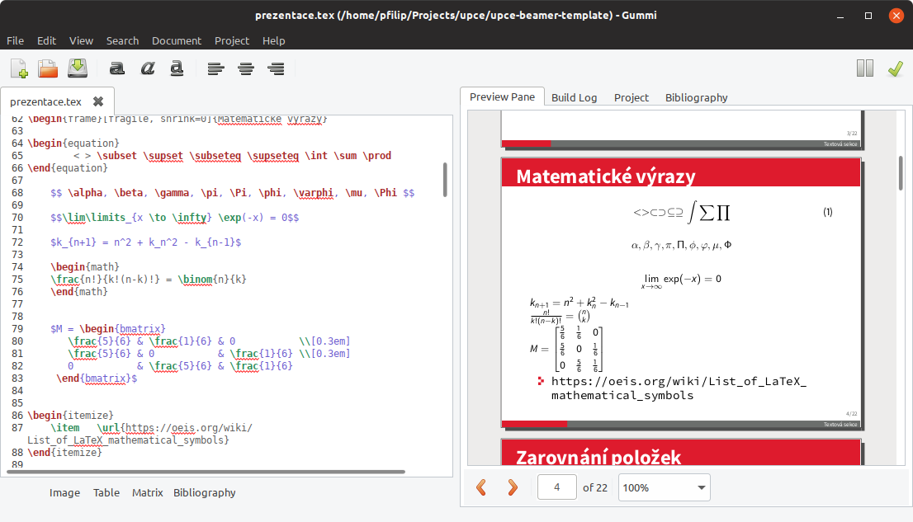

# (NEOFICIÁLNÍ!!) Šablona prezentace & posteru pro Univerzitu Pardubice 

Prezentace            |  Poster
:-------------------------:|:-------------------------:
 |  

## Proč použít tuto šablonu?

Šablona obsahuje loga a barvy všech fakult. Pro změnu barvy stačí změnit **\usepackage[_upce_]{common/theme}**  na **\usepackage[_fei_]{common/theme}** a barevné schéma je přepnuto.
Analogicky lze přepnout na barevné schéma dalších fakult [upce, fcht, fes, dfjp, fei, fzs, ff, fr].

Navíc šablona dobře vypadá a můžete se zaměřit pouze na práci.

Plná ukázka prezentace k nalezení v souboru [prezentace.pdf](prezentace.pdf) a poster v [poster.pdf](poster.pdf).

Nově na ukázku přidány grafy!!!

## Jak začít?

Postačí stáhnout a nainstalovat [TexStudio](https://www.texstudio.org/), otevřít adresář se soubory a můžete začít editovat.
Následně je potřeba soubor zkompilovat. Díky tomu získáte soubor ve formátu PDF.

Na linuxu lze použít editor [Gummi](gummi-editor.png), který je velmi jednoduchý a ihned vidíte výstup.

## Zapoj se

---

Šablona je založena na https://github.com/hamaluik/Beamer-Theme-Execushares
